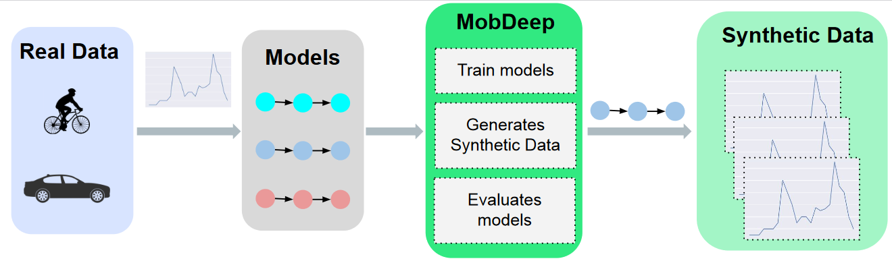
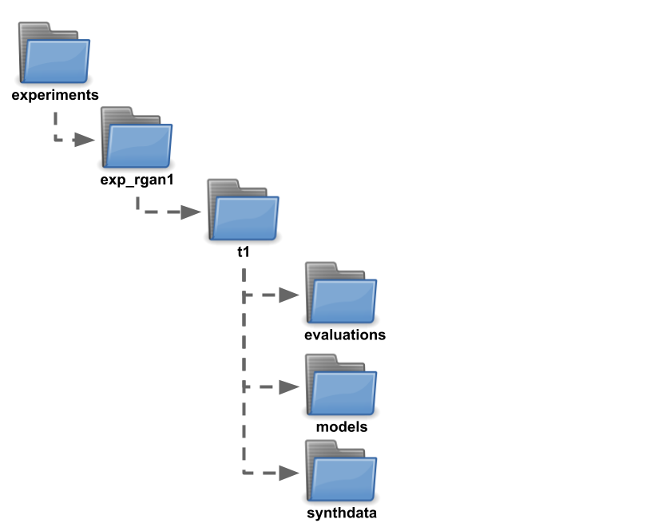

# MobDeep

Framework from the paper *Towards a Framework to Evaluate  Generative  Time Series Models for Mobility Data Features*

# Requirements

This framework was created using previous GANs models [C-RNN-GAN](https://github.com/olofmogren/c-rnn-gan), [RGAN](https://github.com/ratschlab/RGAN) and [TimeGAN](https://github.com/ydataai/ydata-synthetic), however we did not change any of the GAN's architecture or training flow. The modifications we did in the code was only to integrate them in our framework (for example, saving models in a different folder, passing parameters for training, etc).

For this reason, if you want to use the tree models, be aware that each one of them could have differente requirements. The requirement for each model can be folder ``requirements`` in this repository.

# Repo structure

- **datasets**: Folder with real datasets. For testing the code, there is a ``data_test.npy``.
- **experiments**: JSON files with experiments configurations and where files from training will be saved
- **results**:
    - *synthetic_datasets*: Folder with the synthetic datasets generated by each model
- **templates**: config templates for the model's training

## Training folders

When training the models, the following directory structure will be created, based on the file configuration in the files inside the experiments folder.

Each config file will create a folder inside experiments folder, e.g., ``exp_rgan1``. Inside this folder, one or more folders will be created, e.g., ``t1``. In this case, ``t1`` consists of a execution configuration. You can create multiple executions, with different names, varing the parameters in each execution. Inside each execution (``t1``, in this example), three folders will be created:

- ``evaluations``: where the synthetic data evaluation will be saved
- ``models``: where a trained model will be save
- ``synthdata``: where the synthetic dataset will be saved

